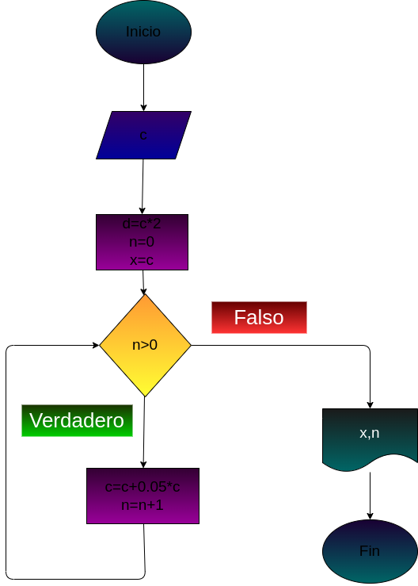

# Ejercicio 6:

## Hacer el diagrama de flujo y el programa en Python que lea un capital C, y que averigüe e imprima en cuantos meses se duplica, si lo colocamos a un interés compuesto del 5% mensual.

## DISEÑO:

